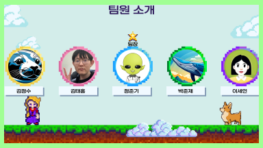
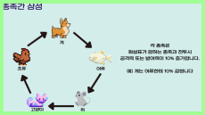
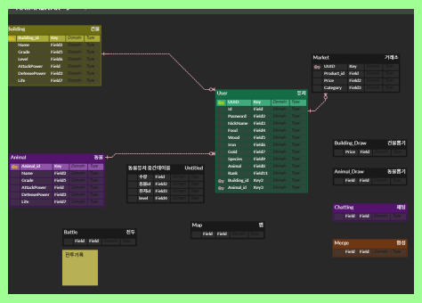
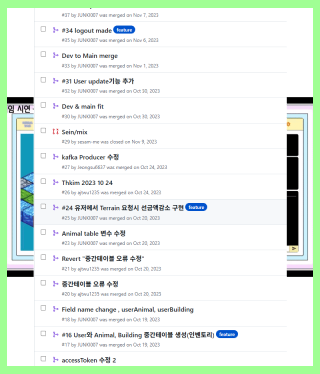
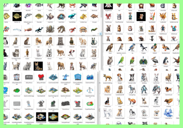

# AnimalWar
***
**AnimalWar**는 MSA(마이크로서비스 아키텍쳐)로 구성된 전략과 RPG 요소를 결합한 웹 기반 게임입니다.
***
&nbsp;
#  🎮 개발 동기
길가에서 우연히 개와 고양이가 싸우는 모습을 보고 영감을 받았습니다. 고양이는 높은 곳에서 뛰어내리며 할퀴고, 개는 큰 소리로 짖으며 위협하는 모습이 인상 깊었고, 서로 전략적으로 싸운다는 생각이 들었습니다. 이를 바탕으로 여러 동물들이 전략적으로 전투하는 게임을 만들면 흥미롭겠다고 생각했습니다. 또한, 게임의 복잡한 데이터 처리와 효율적인 관리를 위해 MSA 구조를 사용하고, HTML5 기반의 게임 엔진을 도전적으로 사용해볼 좋은 기회라 판단하여 개발하게 되었습니다.

&nbsp;
***
&nbsp;
#  🏹 프로젝트 개요

- **장르:** 웹 기반 전략 RPG
- **게임 스토리:**  
지구의 환경오염과 자원 고갈로 더 이상 살 수 없었던 인류는 새로운 정착지를 찾기 위해 고군분투하였고, 결국 애니마르라는 미지의 행성에 도달했다. 이곳은 지구에서 볼 수 있던 동물들뿐만 아니라, 상상 속에서만 존재하던 신비로운 동물들이 살아가는 곳이었다. 하지만 이 행성에는 평화가 존재하지 않았다.
&nbsp;
애니마르의 다섯 종족(조류, 어류, 개류, 고양이류, 설치류)은 수 세기 동안 서로의 영역을 차지하려 치열하게 싸워왔다. 이 전쟁에서 승리하여 행성의 지배권을 쥐기 위해 싸움은 끝없이 이어졌다. 그러던 중, 고지성체인 지구인이 행성에 도달하게 되면서, 그들은 각 종족들에게 전략적 도움을 줄 수 있는 존재로 등장하게 된다. 지구인들은 "전략가"로서 각 종족들에게 필요한 자원을 제공하고, 이들을 위해 전투의 흐름을 조정하며 전쟁을 도왔다.
&nbsp;
지구인 플레이어는 자신이 선택한 종족을 지원하는 역할을 맡게 되며, 이를 통해 강력한 동물 군대를 구축하고 적의 동물 군대와 싸우게 된다. 게임에서 플레이어는 자원 관리, 동물 합성, 강화, 그리고 고등급 동물들을 영입하며 전투력을 높여간다. 이러한 동물들은 각각 고유한 스킬과 능력을 보유하고 있어 전략적 선택을 통해 전투의 승패를 좌우하게 된다. 자원은 단순히 군대 강화에만 쓰이는 것이 아니라, 지구로 송출되어 경제적 이득을 가져오며, 이는 플레이어가 더 강해지고, 더 많은 동물과 건물을 뽑고 강화하는 데 큰 역할을 한다. 그러나 애니마르 행성의 지배권을 쥐기 위해서는 단순한 군대의 크기나 자원의 양만으로는 부족하다. 각 종족의 특성을 잘 파악하고, 전략적인 배치와 스킬 발동을 통해 상대보다 뛰어난 전략을 구사하는 것이 중요하다. 플레이어는 결국 이 전쟁을 끝내고, 애니마르 행성의 최고의 전략가로 군림하며, 새로운 질서를 세우는 것이 목표가 된다.

- **게임 특징:**  
  - 10 X 10 셀 맵에서 동물과 건물을 효율적으로 배치하여 전투력을 향상시키고, 뽑기와 합성을 통해 성장시킬 수 있는 게임
  - 상대의 전투력이 높더라도 스킬 발동 타이밍과 전략을 잘 선택하면 역전이 가능한 전략적 게임
  - 수백여종의 동물들의 각기 다른 특성을 이용할 수 있는 전략적 게임
  - 실시간 채팅, 게시판을 통해 유저간 교류를 중시하는 게임

 
  

&nbsp;
***
&nbsp;
# 🎥 게임영상
[![Gameplay Video]](https://www.youtube.com/watch?v=phCrzrgv9ww)

&nbsp;
***
# 👩‍🦲 팀원소개

1. 정준기 : https://github.com/JUNKI007
2. 박준제 : https://github.com/ptwoj
3. 김정수 : https://github.com/Jeongsu6637
4. 박태홍 : https://github.com/ajtwu1235
5. 이세인 : https://github.com/sesam-me

&nbsp;
***
&nbsp;
# 🛠️ 기술 스택

### **Frontend**
  
  
  

### **Backend**
       
   
   
   

### **DevOps & Tools**
   

&nbsp;
***

&nbsp;
# 📂 레포지터리
- [Frontend](https://github.com/DevineEcho/AnimalWar-front)
- [User Service](https://github.com/DevineEcho/AnimalWar-user)
- [Draw Service](https://github.com/DevineEcho/AnimalWar-draw)
- [Match Service](https://github.com/DevineEcho/AnimalWar-match)
- [Chatting Service](https://github.com/DevineEcho/AnimalWar-chatting)
- [Battle Service](https://github.com/DevineEcho/AnimalWar-battle)
- [Mix Service](https://github.com/DevineEcho/AnimalWar-mix)
- [Upgrade Service](https://github.com/DevineEcho/AnimalWar-upgrade)
- [Exchange Service](https://github.com/DevineEcho/AnimalWar-exchange)
- [Community Service](https://github.com/DevineEcho/AnimalWar-community)
- [Terrain Service](https://github.com/DevineEcho/AnimalWar-terrain)
- [Gateway Service](https://github.com/DevineEcho/AnimalWar-gateway)
- [Eureka Server](https://github.com/DevineEcho/AnimalWar-eureka)
- [Config Service](https://github.com/DevineEcho/AnimalWar-config)
- [Config Data](https://github.com/DevineEcho/AnimalWar-configdata)

&nbsp;
 
***
&nbsp;
# **⚔️  각 서비스별 주요 기능**
&nbsp;
#### **1️⃣ User Service**
- **회원가입 및 로그인**: Spring Security 통한 비밀번호 암호화, JWT 토큰인증
- **유저 데이터 관리**: 엔티티 설계 및 DB 연동

&nbsp;

#### **2️⃣ Draw Service**
- **동물 및 건물 뽑기 시스템**  
  - 등급별 상이한 확률에 따른 뽑기 
  - pick 메소드 -> Kafka메시지 전송 -> User에서 Kafka 받음 -> 유저 DB 반영

&nbsp;

#### **3️⃣ Match Service**
- **전투시 스킬 세팅**  
  - 전투 돌입전 자신의 방어형 스킬, 공격형 스킬을 세팅 -> Kafka 메시지 전송 -> 유저 DB 반영
- **랜덤 매칭**  
  - 현재는 전체 유저중 랜덤 매칭이나, 차후 전투력 기반 매칭, 종족별 매칭으로 고도화 예정
   - 프론트엔드에서 전투시작시, 매칭서비스에 의해 매칭된 후, 배틀서비스에 의해 전투 진행

&nbsp;

#### **4️⃣ Battle Service**
- **전투 처리 시스템**  
  - 각 스킬을 정의
  - 전투시 종족간 상성에 의해 Enum 종족에 따라 스킬이 상이하게 적용되도록 함
  - 전투 상대 체력이 0이하가 될때까지 반복되는 메소드를 실행하여 전투 결과를 도출 -> Kafka 메시지 전송 -> 유저 DB 반영

&nbsp;

#### **5️⃣ Chatting Service**
- **실시간 채팅 시스템**  
  - WebSocket을 이용한 실시간 채팅
  - 채팅데이터는 Mysql DB에 남아있어 확인 가능

&nbsp;

#### **6️⃣ Mix Service**
- **동물 및 건물 합성 시스템**  
  - 프론트엔드에서 User service의 인벤토리 확인 메소드를 통해 보유 동물, 건물이 나옴
  - 프론트엔드에서 합성에 요구되는 동물을 선택해 합성 시작 -> Mix service의 메소드 -> 결과 Kafka 전송 -> 유저 DB 반영
  - 일정 확률에 의해 합성이 성공하게되면 상위 등급 동물 및 건물을 획득할 수 있음
  - 합성 시도에 실패할 경우, 합성재료로 들어간 동물 및 건물은 소멸

&nbsp;
  
#### **7️⃣ Upgrade Service**
- **동물 및 건물 강화 시스템**  
  - 프론트엔드에서 User service의 인벤토리 확인 메소드를 통해 보유 동물, 건물이 나옴
  - 프론트엔드에서 동물 및 건물 강화시작 -> Upgrade service의 메소드 -> 결과 Kafka 전송 -> 유저 DB 반영
  - 강화된 동물 및 건물은 강화수치에 따라 다른 전투력을 부여

&nbsp;

#### **8️⃣ Exchange Service**
- **거래소 서비스**  
  - 프론트엔드의 Market.js와 매칭되는 서비스
  - 보유 중인 동물 및 건물을 거래소에 등록하여 유저간 거래가 가능
  - 프론트엔드 Exchange.js(자원->골드 환전기능)와 이름이 같아 혼동될 수 있어 차후 수정 예정

&nbsp;

#### **9️⃣ Terrain Service**
- **맵 시스템**  
  - 유저는 10 X 10 셀의 개인 맵을 보유하게되고, 그 맵은 매셀마다 육지, 바다, 산지의 특성을 가지고 있습니다.
  - 특정 종족은 특정 맵에 배치될 경우 더 강한 효과를 가지게 되므로, 전략적으로 사용하는 것이 중요합니다.
  - 회원가입시 User Service에서 Kafka메시지 전송 -> 최초 맵 생성 -> Kafka 다시 유저로 전송하여 유저 DB 반영
  - 재화를 이용하여 맵을 재생성 -> Kafka 메시지 전송 -> 유저 DB 반영
  
&nbsp;

#### **🔟 Community Service**
- **게시판 시스템**  
  - 유저들이 자유롭게 글을 작성할 수 있는 게시판을 만들어 소통을 유도

&nbsp;

    
#### **1️⃣1️⃣ Gateway Service**
- **API 게이트웨이**  
  - 모든 마이크로서비스의 트래픽을 중앙에서 관리
  - 각 서비스의 요청을 라우팅하여, 응답을 클라이언트에 전달

&nbsp;
    
#### **1️⃣2️ Eureka Service**
- **Eureka 서버**  
  - 각 서비스가 유레카 서버에 등록되어 서비스 검색이 용이
  - 서비스 인스턴스를 동적으로 로드하여 시스템의 확장성 증대

&nbsp;
    
#### **1️⃣3️⃣ Config Service**
- **동적인 서버 관리**  
  - Spring Cloud Config Server를 활성화하여, 어플리케이션 설정파일을 깃레포지터리(ConfigData)에서 가져옴
  - 현재 config data는 JWT 암호화 설정을 해두었고, 서비스의 설정을 중앙에서 관리하기 위해 이용

  

&nbsp;

***
&nbsp;

# 🐵 개발 과정 및 후기 (2023.10.02 ~ 2023.12.08)

### 1. 첫 단추: 게임 아이디어와 기획
게임 개발의 시작은 학원에서 만난 5명의 팀원과 함께였으며, 우연히 길에서 본 개와 고양이의 싸움에서 영감을 얻어 **AnimalWar**라는 게임을 만들기로 결심하였습니다. 게임을 만들 때, 효율성과 확장성을 고려한 아키텍처가 필요하다고 판단했습니다. 이에 MSA 구조를 채택하고, Spring Boot와 React를 사용하여 게임을 개발하기로 했습니다.

초기 기획 단계에서 게임의 스토리와 엔딩을 정의하고, ERD를 작성하여 필요한 엔티티들과 그들 간의 관계를 파악했습니다. 기획안은 2일 만에 완성되었고, 개발 중에도 지속적으로 수정되었습니다.

 

기획안과 ERD가 정리되니 필요한 서비스가 명확해졌습니다. 팀원들은 자신이 가장 잘할 수 있는 파트를 맡기로 했고, 부족한 기술을 보완할 수 있는 업무 분담이 이루어졌습니다. 게임 엔진 선택에서도 효율성과 가벼운 성능을 고려하여 Pixi.js를 선택하였고, 처음 사용해보는 라이브러리였지만 문서를 참조하며 학습해 나갔습니다.

&nbsp;

### 2. 백엔드부터 차근차근 개발하기
FIGMA를 이용하여 프론트엔드의 대략적인 레이아웃을 구성한 후, 백엔드 서비스부터 개발을 시작했습니다. 유저 서비스, 맵 서비스, 뽑기 서비스 등을 담당하며 백엔드 구조를 먼저 잡고, 그에 맞춰 프론트엔드를 개발하는 방식으로 진행했습니다. 개발 초기부터 git push와 커밋 관리를 철저히 하여, 팀원 간의 코드 공유와 관리가 원활하게 이루어졌습니다.

 

매 2~3일마다 Slack을 통해 진행 상황을 공유하고, 팀장이 피드백을 주는 방식으로 개발을 이끌어 갔습니다. 멘토링 기회를 통해 현직 개발자에게 코드 리뷰를 받으며, 실무에 가까운 수준으로 코드를 다듬어 갔습니다.

 
 

&nbsp;

### 3. 게임의 복잡성을 체감하다
게임 요소마다 필요한 이미지 제작과 파일 관리에 많은 시간이 소요되었습니다. 처음에는 Firebase 무료플랜을 이용해 이미지를 클라우드에 저장하고 불러왔으나, 사용되는 이미지가 많아 금방 용량 한도를 초과했습니다. 결국, WebP 형식으로 이미지를 최적화하여 React 프로젝트 폴더에 저장하고, 이를 불러오는 방식으로 변경했습니다.

 

게임의 핵심 요소인 전투 시스템, 합성 시스템, 맵 관리 등 다양한 게임 기능을 구현하면서, 기획안은 점차 수정되고 고도화되었습니다. 초기 기획안보다 약 3배 정도 많은 컨텐츠가 추가되었으며, 밸런싱 문제를 해결하는 과정에서도 많은 수정이 있었습니다. 예를 들어, 전투 데미지 수치, 재화 요구치 등 여러 수치를 반복적으로 수정하여, 게임의 균형을 맞추었습니다.
&nbsp;

### 4. 후기
MSA 구조를 사용한 가장 큰 장점은 13개의 많은 서비스가 독립적으로 운영될 수 있었고, 언제든 추가하고 싶은 서비스가 있으면 확장 가능했고 유지보수가 용이했다는 점입니다. Spring Boot와 React의 조합은 개발이 직관적이고 효율적이었으며, 각 서비스 간의 연동이 잘 이루어졌습니다. 특히, Kafka를 통한 비동기 메시지 처리를 통해 수많은 유저의 동시다발적인 트래픽에도 대비할 수 있었고, 독립적인 서비스끼리 원활하게 연결할 수 있도록하여 MSA 구조에도 잘 맞았다고 생각합니다.

그러나 MSA 구조를 사용할 때, 서비스 개수가 많아지고, 각 서비스 간의 연결을 유지하는 데 있어 복잡성이 증가하였고, 시스템 리소스를 많이 사용하여 서버 요구사항이 커지는 문제가 있었습니다. 특히, 모든 서비스를 동시에 작동시키기 위한 메모리 요구량이 높아져 개발에 사용한 노트북의 메모리 부족으로 서버가 자동으로 닫혀버리는 문제도 있었습니다.

개발 과정에서 협업과 의사소통이 매우 중요함을 느꼈습니다. 매일매일의 작업 관리, 피드백을 통한 진척도 체크가 프로젝트 성공의 중요한 요소였고, 멘토링과 팀 내 지식 공유가 큰 도움이 되었습니다.

결론적으로, MSA 아키텍처와 Spring Boot와 React 스택을 사용한 AnimalWar 프로젝트는 기술적으로 많은 성장을 이룬 프로젝트였습니다. 여러 가지 기술적 도전을 경험하며, 실제로 배운 것을 바탕으로 구현할 수 있었던 값진 경험이었습니다. 프로젝트를 통해 게임 개발에 필요한 핵심 기술뿐만 아니라, 협업과 문제 해결 능력까지 키울 수 있었습니다.

&nbsp;
***
&nbsp;
## 🔥 TroubleShooting

## 1. PIXI와 React 상태 관리 불일치 문제
- **문제**: PIXI로 게임 화면을 구성하면서 상태 관리가 제대로 되지 않아 화면 렌더링이 정상적으로 이루어지지 않는 문제 발생
- **원인**: React는 가상 DOM을 사용해 상태 관리를 진행하고, PIXI는 실제 DOM을 사용해 화면을 그리므로 상태가 일치하지 않아 렌더링 오류가 발생
- **해결 방법**:
  - React를 사용하여 동적인 애니메이션이나 상태 관리가 필요 없는 화면 요소를 관리
  - PIXI는 오직 실제 화면에서 동적인 움직임을 처리하는 데 사용
  - 결과적으로 PIXI앱인 것처럼 보이나, React로 만든 웹페이지로 대체함

&nbsp;

## 2. Kafka 데이터 송수신 문제
- **문제**: Kafka를 통한 데이터 송수신 시 데이터가 제대로 전달되지 않음
- **원인**:
  1. Request와 Response 객체가 동일한 타입으로 맞춰지지 않아 발생한 문제
  2. `application.yml` 설정에서 JsonConverter를 추가하지 않아 직렬화 오류 발생
- **해결 방법**:
  - Request와 Response의 타입을 정확히 일치시키고, 특히 `Enum` 타입을 사용할 때 String 대신 객체를 넣어줌.
  - `application.yml`에 JsonConverter를 추가하여 문제 해결.

&nbsp;

## 3. 서버-프론트 간 정보 동기화 문제
- **문제**: 전투 중 서버에서 발생한 이벤트나 스킬 정보가 프론트로 제대로 전달되지 않음
- **원인**: 서버와 프론트 간 정보 불일치로 인해 사용자가 실제 전투 상황과 다른 정보를 보게 되는 문제가 발생
- **해결 방법**:
  - 서버에서 발생하는 이벤트나 스킬 적용 정보를 정확하게 프론트에 전달하고, 그 정보가 실시간으로 반영되도록 수정
  - 서버-프론트 간 실시간 동기화 개선

&nbsp;

## 4. 스킬 기능 구현 및 예외 처리 문제
- **문제**: 스킬 기능이 제대로 적용되지 않거나 예외 처리 부족으로 인해 오류 발생
- **원인**: 각 스킬이 적용될 때 예외 상황에 대한 처리가 부족했음
- **해결 방법**:
  - 스킬 적용 로직을 수정하고, 각 스킬에 대한 예외 상황을 정확하게 처리하여 안정성을 개선
    (예시 : 공격시와 수비시의 전투력이 상이하고, 스킬이 그 상이한 전투력을 가져와야하나, 공격시 전투력만 가져옴)
  - 유닛 테스트를 통해 스킬 적용 로직의 안정성을 지속적으로 검증하고, 예기치 못한 상황에 대한 테스트 케이스를 추가

&nbsp;

## 5. Firebase 무료 할당량 초과 문제
- **문제**: Firebase 무료 할당량을 초과하여 이미지 저장 및 로딩 문제가 발생
- **원인**: 이미지 파일들이 Firebase에 저장되었지만, 무료 플랜의 할당량을 초과하여 오류 발생
- **해결 방법**:
  - 처음에는 에러메시지 이미지링크, 이미지의 과도한 크기 등으로 발생하는 줄 알았으나, 단순 플랜 할당량 초과였음
  - 이미지 파일의 확장자를 `.png`에서 `.webp`로 변환하여 용량을 줄임
  - 프로젝트 내부에 `.webp` 이미지를 저장하고, 이를 사용하여 Firebase 할당량 초과 문제를 해결

&nbsp;

***
&nbsp;
## 📬 문의
- Contact: junejjk@gmail.com
